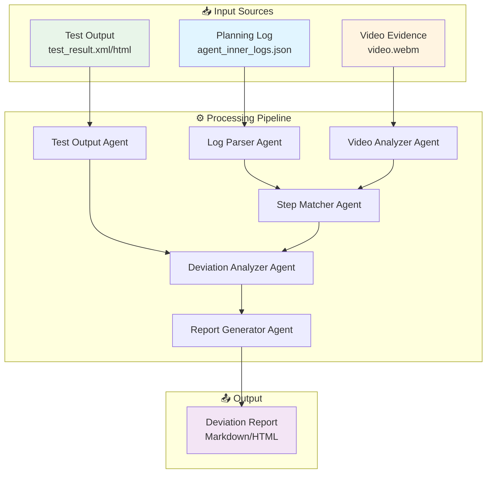
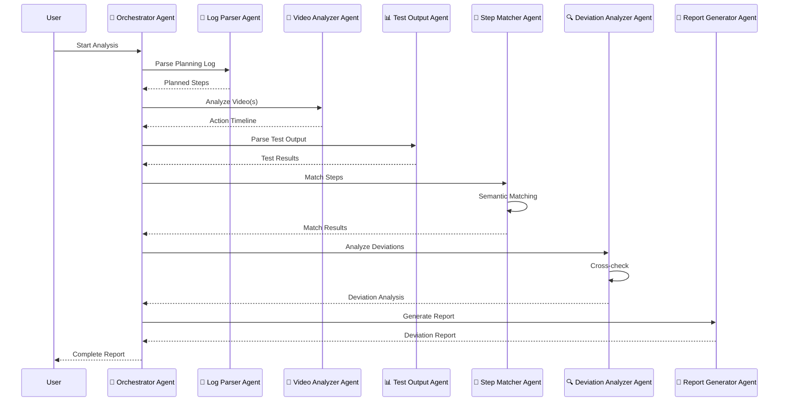
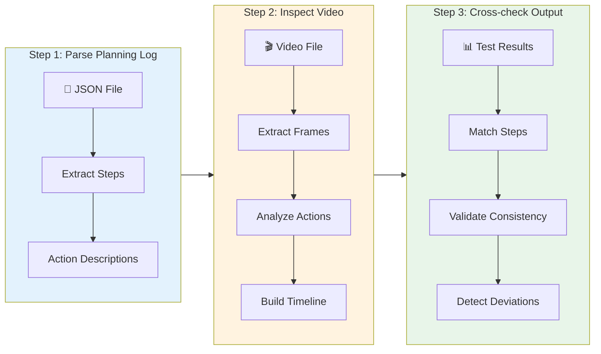
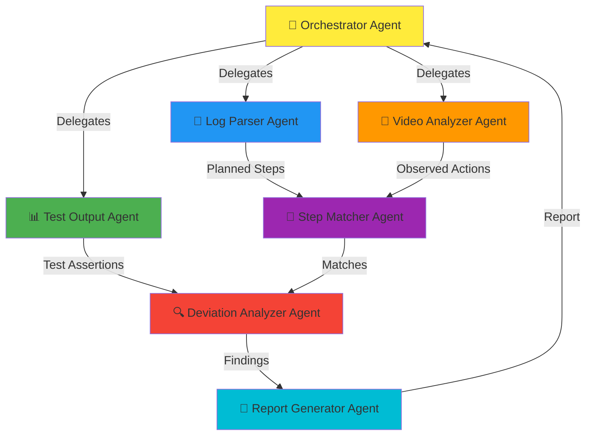
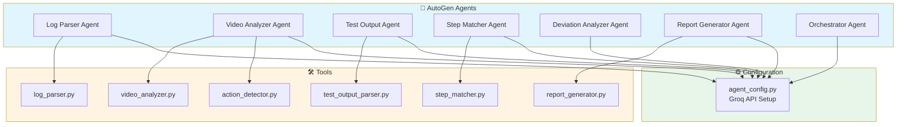

# 🎬 Video Analysis Agent

<div align="center">


**A multi-agent system that evaluates whether a Hercules test run was executed as planned by comparing planning logs, video evidence, and test outputs to detect deviations.**

[Features](#-features) • [Installation](#-installation) • [Usage](#-how-to-run) • [Architecture](#-architecture) • [Documentation](#-documentation)

</div>

---

## 📋 Overview

The Video Analysis Agent is an intelligent system that validates test execution by analyzing three critical data sources:

<div align="center">

| 📝 Planning Log | 🎥 Video Evidence | 📊 Test Output |
|:---:|:---:|:---:|
| Intended actions | Actual execution | Final results |
| Step-by-step plan | Screen recordings | Assertions & outcomes |

</div>

The agent uses **semantic matching** and **multi-agent orchestration** to detect if claimed actions are visibly executed in videos and flags any deviations (skipped, altered, or not visible actions).

---

## ✨ Features

<div align="center">

| Feature | Description |
|:---:|:---|
| 🔍 **Log Parsing** | Extract planned steps from `agent_inner_logs.json` |
| 🎬 **Video Analysis** | Process single or multiple videos with frame extraction |
| 📄 **Test Output Parsing** | Parse XML/HTML test results |
| 🎯 **Semantic Matching** | Intelligent matching between planned and observed actions |
| 📈 **Deviation Detection** | Identify skipped, altered, or missing actions |
| 📝 **Report Generation** | Generate comprehensive Markdown/HTML reports |
| 🤖 **Multi-Agent Architecture** | AutoGen-powered agent orchestration |
| ⚡ **Groq API** | Powered by GPT-OSS-120B model |

</div>

---

## 🚀 Installation

### Prerequisites

- **Python** >= 3.13
- **[uv](https://github.com/astral-sh/uv)** package manager

### Quick Start

```bash
# 1. Clone the repository
git clone <repository-url>
cd video-analysis-agent

# 2. Install dependencies
uv sync

# 3. Set up environment variables
cp .env.example .env
# Edit .env and add your Groq API key

# 4. Run the agent
uv run python main.py
```

### Environment Setup

Create a `.env` file with your Groq API key:

```bash
GROQ_API_KEY=your_groq_api_key_here
```

> 💡 **Note:** Get your API key from [Groq Console](https://console.groq.com/)

---

## 🎮 How to Run

### Basic Usage

Run with default input files:

```bash
uv run python main.py
```

### Advanced Usage

```bash
# Custom input files
uv run python main.py \
  --log data/agent_inner_logs.json \
  --video data/video.webm \
  --test-output data/test_result.xml \
  --output output/deviation_report.md

# Multiple videos
uv run python main.py \
  --video data/video1.webm data/video2.webm data/video3.webm

# HTML output
uv run python main.py --format html
```

### Command-Line Options

| Option | Description | Default |
|:---|:---|:---|
| `--log` | Path to `agent_inner_logs.json` | `data/agent_inner_logs.json` |
| `--video` | Path(s) to video file(s) | `data/video.webm` |
| `--test-output` | Path to test result file | `data/test_result.xml` |
| `--output` | Output path for report | `output/deviation_report.md` |
| `--format` | Output format (markdown/html) | `markdown` |

---

## 📁 Where Output is Saved

Reports are saved to the `output/` directory:

- **Default:** `output/deviation_report.md`
- **Custom:** Specify with `--output` flag
- **Formats:** Markdown (`.md`) or HTML (`.html`)

The output directory is created automatically if it doesn't exist.

---

## 🏗️ Architecture

### System Architecture Overview



### Multi-Agent Workflow



### Processing Steps Flow



### Agent Communication Pattern



### Component Architecture



---

## 📊 Sample Inputs and Expected Outputs

### Input File Formats

#### 📝 Planning Log (`agent_inner_logs.json`)

```json
{
  "planner_agent": [
    {
      "content": {
        "plan": "1. Navigate to the Wrangler website...\n2. Click on Search icon...",
        "next_step": "Navigate to the URL https://wrangler.in...",
        "next_step_summary": "Navigate to https://wrangler.in and validate homepage load",
        "terminate": "no",
        "is_assert": false
      }
    }
  ]
}
```

**Key Fields:**
- `plan`: Full plan as numbered list
- `next_step`: Detailed step description
- `next_step_summary`: Brief step summary
- `is_assert`: Boolean indicating if this is an assertion

#### 🎬 Video File (`video.webm`)

- **Format:** WebM, MP4, or other formats supported by OpenCV
- **Content:** Screen recording of the test execution
- **Multiple videos:** Supported for full coverage

#### 📊 Test Output (`test_result.xml` or `test_result.html`)

**XML Format:**
```xml
<testsuite>
  <testcase>
    <failure message="EXPECTED RESULT: ... ACTUAL RESULT: ..."/>
    <properties>
      <property name="plan" value="1. Navigate..."/>
    </properties>
  </testcase>
</testsuite>
```

### 📈 Expected Output Format

The deviation report includes:

```markdown
# Deviation Report

## Summary
- **Total Steps:** 10
- **Observed:** 8
- **Deviations:** 2

## Detailed Results

| Step Description | Result | Notes |
|------------------|--------|-------|
| Navigate to https://wrangler.in | ☑ Observed | Observed at 00:05 |
| Click the Search icon | ☑ Observed | Observed at 00:12 |
| Enter 'Rainbow sweater' | ☑ Observed | Observed at 00:18 |
| Select 'Turtle Neck' filter | ✗ Deviation | Step skipped in video |
```

---

## ⚙️ Configuration

### Groq API Configuration

The agent uses Groq API with the following settings:

| Setting | Value |
|:---|:---|
| **Model** | `openai/gpt-oss-120b` |
| **Base URL** | `https://api.groq.com/openai/v1` |
| **API Key** | Set in `GROQ_API_KEY` environment variable |

Configuration is managed in `src/config/agent_config.py`.

---

## 📂 Project Structure

```
video-analysis-agent/
├── 📁 src/
│   ├── 🤖 agents/              # AutoGen agents
│   │   ├── log_parser_agent.py
│   │   ├── video_analyzer_agent.py
│   │   ├── test_output_agent.py
│   │   ├── step_matcher_agent.py
│   │   ├── deviation_analyzer_agent.py
│   │   ├── report_generator_agent.py
│   │   └── orchestrator_agent.py
│   ├── 🛠️ tools/               # Tool functions
│   │   ├── log_parser.py
│   │   ├── video_analyzer.py
│   │   ├── action_detector.py
│   │   ├── test_output_parser.py
│   │   ├── step_matcher.py
│   │   └── report_generator.py
│   ├── ⚙️ config/              # Configuration
│   │   └── agent_config.py
│   └── 🚀 main.py              # Entry point
├── 📁 data/                    # Sample input files
├── 📁 output/                  # Generated reports
├── 📄 pyproject.toml           # Project dependencies
└── 📖 README.md               # This file
```

---

## 🔧 Troubleshooting

### Common Issues

| Issue | Solution |
|:---|:---|
| **Video file not found** | Ensure video path is correct and file has read permissions |
| **API key error** | Verify `GROQ_API_KEY` is set in `.env` file |
| **Import errors** | Run `uv sync` to install dependencies |
| **No matches found** | Check video contains visible actions, verify planning log has valid steps |

---

## 🧪 Development

### Running Tests

```bash
# Run comprehensive test suite
uv run python test_agent.py

# Test individual components
uv run python -m src.tools.log_parser
uv run python -m src.tools.test_output_parser
```

### Adding New Features

1. Add tool functions in `src/tools/`
2. Create corresponding agents in `src/agents/`
3. Update `src/main.py` to integrate new features

---

## 📚 Documentation

- **[BLOCKERS.md](BLOCKERS.md)** - Known issues and solutions
- **[TEST_RESULTS.md](TEST_RESULTS.md)** - Test execution results
- **[VIDEO_WALKTHROUGH_GUIDE.md](VIDEO_WALKTHROUGH_GUIDE.md)** - Guide for creating video walkthrough

---

## 📄 License

See [LICENSE](LICENSE) file for details.

---

## 🤝 Contributing

This is an assessment project. For questions or issues, please refer to the assignment documentation.

---

<div align="center">

**Built with ❤️ using AutoGen and Groq API**

[⬆ Back to Top](#-video-analysis-agent)

</div>
